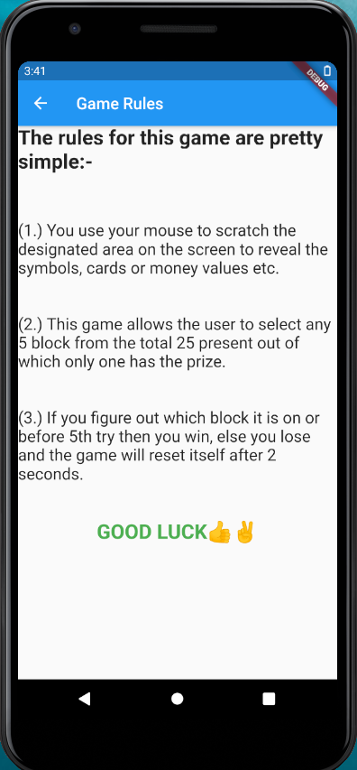
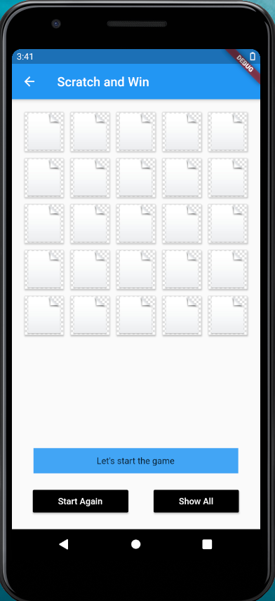
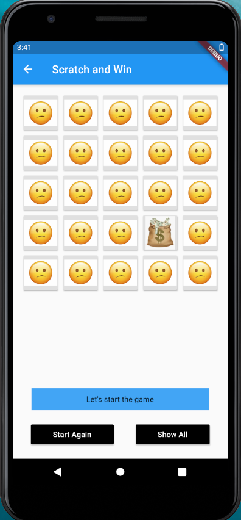
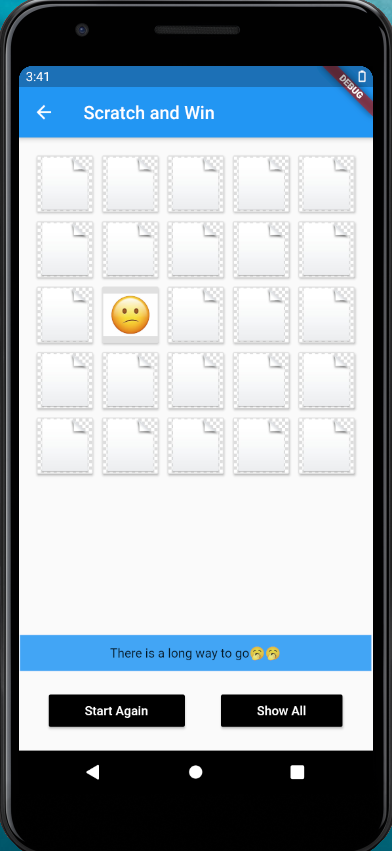
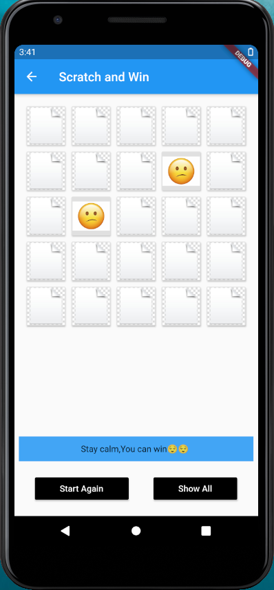
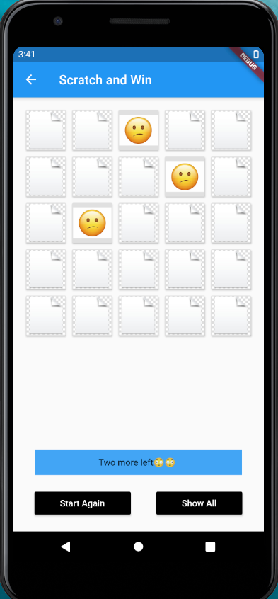
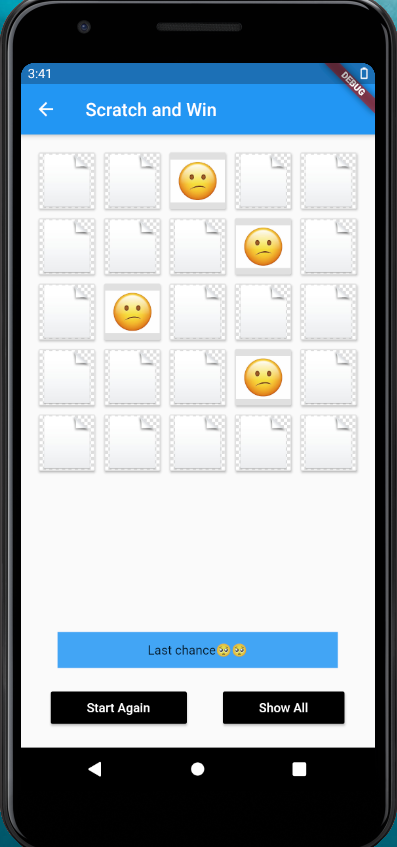
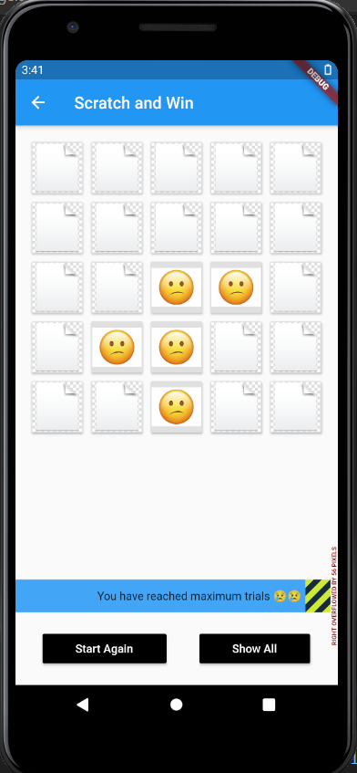

# Scratch_and_Win
### About the app
<b>Built Using</b>
<ul><li>Flutter</li></ul>

This Flutter app allows the user to select any 5 block from the total 25 present out of which only one has the prize.If you figure out which block it is on or before 5th try then you win, else you lose and the game will reset itself. It's a game of Luck.
<h3 align="center">GOOD LUCK 😉👌</h3>
<b>Things which are used in this app are:-</b>
<ol>
  <li>MaterialApp design</li>
  <li>Scaffold class</li>
  <li>AppBar</li>
  <li>Stateless and Stateful widget.</li>
  <li>Safe Area</li>
  <li>Grid View</li>
  <li>Layout building</li>
  <li>Various images display</li>
  <li>Audioplayer and audio cache</li>
  <li>Navigator</li>
  <li>Raised buttons</li>
</ol>
<b>Some Snaps from the App:-</b>

 &nbsp; &nbsp;  &nbsp; &nbsp; &nbsp; &nbsp;  &nbsp; &nbsp;
 &nbsp; &nbsp;  &nbsp; &nbsp; &nbsp; &nbsp;  &nbsp; &nbsp;
 &nbsp; &nbsp;  &nbsp; &nbsp; &nbsp; &nbsp;  &nbsp; &nbsp;  

 &nbsp; &nbsp;  &nbsp; &nbsp; &nbsp; &nbsp;  &nbsp; &nbsp;
  &nbsp; &nbsp;  &nbsp; &nbsp; &nbsp; &nbsp;  &nbsp; &nbsp;
  &nbsp; &nbsp;  &nbsp; &nbsp;  

 &nbsp; &nbsp;  &nbsp; &nbsp; &nbsp; &nbsp;  &nbsp; &nbsp;
  &nbsp; &nbsp;  &nbsp; &nbsp; &nbsp; &nbsp;  &nbsp; &nbsp;
  &nbsp; &nbsp;  &nbsp; &nbsp;  

## Show some ❤️ and ⭐ the repo if you find it useful.
 ### Getting Started
This project is a starting point for a Flutter application.
 
A few resources to get you started if this is your first Flutter project:
<ul>
 <li>
  <a href="https://flutter.dev/docs/get-started/codelab">Lab: Write your first Flutter app</a>
 </li>
 <li>
  <a href="https://flutter.dev/docs/cookbook">Cookbook: Useful Flutter samples</a>
 </li>
 </ul>
For help getting started with Flutter, view our <a href="https://flutter.dev/docs">online documentation</a>, which offers tutorials, samples, guidance on mobile development, and a full API reference.
